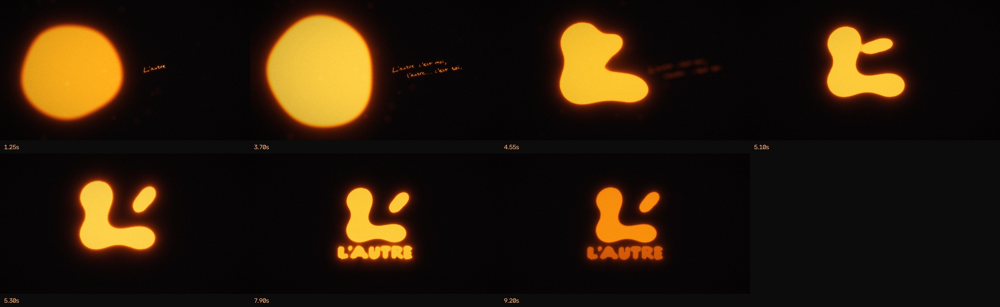

# L'AUTRE — intro de chaîne

Intro motion design de 9,6 s pour la chaîne documentaire **L'AUTRE**, construite à partir des trois
variantes du logo (le symbole flou + la phrase manuscrite, le symbole net, le lockup avec le nom).



## L'idée : « L'autre c'est moi, l'autre… c'est toi. »

Le symbole raconte déjà une histoire : un grand L et une petite apostrophe, faits de la même lumière.
L'intro montre **la naissance de l'autre** : l'apostrophe n'est pas posée à côté du L, elle se détache de lui.

| Temps | Plan | Image | Son |
|---|---|---|---|
| 0,0 – 0,5 s | **Le noir** | grain argentique seul | souffle de salle, drone grave |
| 0,5 – 3,8 s | **L'étincelle** | un battement de cœur allume une lumière floue, vivante comme une cellule (rouge → orange → ambre, comme un filament qui chauffe). À droite, la phrase s'écrit à la plume de lumière | lub-dub, plume sur papier synchronisée trait par trait |
| 3,8 – 4,9 s | **La mise au point** | bascule de point : la phrase part dans le flou, la lumière se précise et prend la forme du L | montée de tension, la nappe s'ouvre |
| 4,7 – 5,6 s | **La division** | un bourgeon gonfle dans l'épaule du L, le pont de matière s'étire, s'amincit… et cède. L'apostrophe file à sa place et se balance | étirement élastique, goutte, impact sub, cloche |
| 5,9 – 6,9 s | **Le nom** | la caméra recule, L'AUTRE se remplit de lumière lettre par lettre | une note par lettre (pentatonique de ré), accord de ré majeur |
| 6,9 – 8,6 s | **La tenue** | le logo respire, lente poussée caméra | nappe, résonances |
| 8,6 – 9,6 s | **L'extinction** | la lumière refroidit (jaune → orange → rouge) puis s'éteint | glissando descendant, « tics » de métal qui refroidit |

Détails : formes du logo extraites au pixel des visuels fournis (champs de distance), couleurs calées sur la
photo du logo, flou d'objectif en disque (bokeh), respiration de mise au point, poussières en suspension
hors du plan de netteté, halo, aberration chromatique légère, vignettage, grain animé.

## Fichiers livrés

| Fichier | Usage |
|---|---|
| `output/LAUTRE_intro_1080p.mp4` | 1920×1080, 24 i/s, H.264 + AAC 320 kb/s |
| `output/LAUTRE_intro_4K.mp4` | 3840×2160, 24 i/s, H.264 + AAC 320 kb/s |
| `output/intro_audio.wav` | le son seul (48 kHz / 24 bits, −15 LUFS, crête −1 dBTP) |
| `output/storyboard.jpg` | les 7 temps forts |

**Au montage** : l'intro commence et finit sur du noir. Le son démarre sur le premier battement (0,5 s) et
s'éteint avec la lumière. Un cut sec vers ta première image fonctionne très bien.
Pour une timeline à 25 ou 30 i/s, régénère plutôt à la bonne cadence (voir ci-dessous) que de laisser le
logiciel convertir.

## Régénérer / modifier

```bash
pip install -r requirements.txt          # + ffmpeg
python3 intro/build.py                   # 1080p 24 i/s
python3 intro/build.py --res 2160        # 4K
python3 intro/build.py --fps 25          # autre cadence
python3 intro/render.py --res 540 --times 1.2,5.1,7.9   # planche d'aperçu rapide
```

- `intro/assets.py` : extraction des formes depuis `assets/source/` (L, apostrophe, lettres, phrase + ordre d'écriture).
- `intro/render.py` : la timeline (constantes en tête de fichier), la caméra, la lumière, le rendu image.
- `intro/audio.py` : le sound design, calé automatiquement sur la timeline (l'instant exact où le pont cède est calculé).

---

## Autres projets du dépôt

[`pub-chine/`](pub-chine/README.md) — *Creator is the new athlete* : pub 3D isométrique de 62 s sur la Chine,
eldorado des créateurs, pour la formation de Nik & Odyo.

[`le-dernier-selfie/`](le-dernier-selfie/README.md) — *Le dernier selfie* : 35 s d'animation façon stop-motion
réaliste tirées d'une seule image. Dix personnes aux yeux blancs se lèvent une à une et quittent le cadre
d'un selfie, jusqu'au canapé vide.

## Outil de montage : dérush + B-rolls dans DaVinci Resolve

Le dossier [`davinci-derush/`](davinci-derush/README.md) contient le pipeline qui dérushe ta voix
(blancs, « euh », prises ratées) et cale tes B-rolls dans DaVinci Resolve Studio, piloté par Claude Code.
