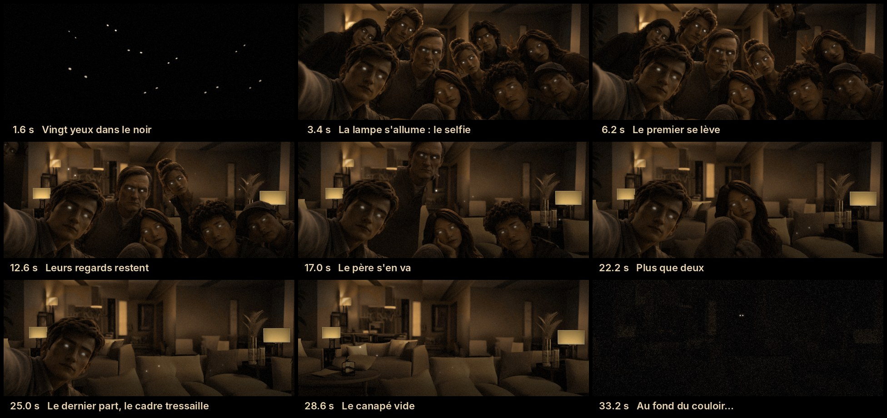

# LE DERNIER SELFIE — l'image qui se vide

Court film d'animation de 35 s (1920×1080, format 2,16:1 avec bandes noires, 24 i/s, son inclus) tiré
d'une seule image : le selfie de groupe sépia aux yeux blancs. Les dix personnes se lèvent une à une et
sortent du cadre, lentement, jusqu'au canapé vide.



## Le style : une stop-motion réaliste

- **Saccadé volontaire** : les poses changent 12 fois par seconde (animation « en deux » sur une base
  24 i/s), comme une série animée image par image.
- **Marionnettes replacées à la main** : à chaque pose, chaque personnage tremble d'un demi-pixel et la
  lumière varie d'un rien, comme entre deux photos d'un tournage en stop-motion.
- **Vraie 3D** : une carte de profondeur (Depth Anything V2) donne du relief à chaque visage ; quand un
  personnage se détourne pour partir, il tourne réellement (le nez passe devant la joue).
- **Grammaire du mouvement** : anticipation (on se tasse, on penche vers la sortie), on se lève avec un
  départ lent et une arrivée amortie, puis on sort en marchant (petits rebonds de pas).
- Caméra qui pousse lentement, halo sur les yeux et les lampes, grain argentique, vignettage.

## Le récit

| Temps | Plan | Image | Son |
|---|---|---|---|
| 0,0 – 2,3 s | **Le noir** | vingt yeux s'allument un à un dans l'obscurité | tintements de verre |
| 2,3 – 4,6 s | **Le selfie** | la lampe s'allume en hésitant : le groupe, figé, qui respire à peine | interrupteur, bourdonnement de l'ampoule ; un accord de dix notes s'ouvre |
| 4,6 – 15 s | **Ils partent** | du fond vers l'avant, ils se lèvent et sortent par les côtés. Leur regard reste un instant, suspendu là où il était, puis s'éteint | à chaque départ, une note de l'accord s'éteint ; boîte à musique quand le regard se détache ; froissements, pas feutrés spatialisés |
| 15 – 23 s | **Le père, puis les derniers** | l'homme du centre se lève lourdement ; il ne reste que la fille au menton dans la main et celui qui tient le téléphone | l'accord n'a plus que ses notes graves |
| 23,9 – 27 s | **Le dernier** | celui qui tenait le téléphone part à son tour ; le cadre tressaille | choc sourd, cliquetis |
| 27 – 30,4 s | **Le canapé vide** | la pièce, déserte ; les derniers regards s'effacent | souffle de la salle, plus de musique |
| 30,4 – 32,6 s | **La lampe** | elle vacille, puis s'éteint | grésillements, déclic |
| 32,6 – 34,4 s | **Au fond du couloir** | dans le noir, deux yeux s'ouvrent… et clignent | souffle grave, note de verre |
| 34,4 – 35 s | **Coupe** | noir | silence sec |

## Comment c'est fabriqué

1. `prep/segment.py` — détection des 10 personnes (Mask2Former) et carte de profondeur (Depth Anything V2).
2. `prep/refine.py` — masques nets (SAM ViT-H) puis partage de l'avant-plan entre les personnes le long des
   discontinuités de profondeur. Corrections à la main : la main en V, les genoux en maille.
3. `prep/plate.py` — la pièce vide : inpainting Stable Diffusion (le salon, le canapé aux coussins creusés,
   les lampes), réétalonné en sépia et replongé dans la pénombre de l'original.
4. `prep/layers.py` — une marionnette par personne : calque détouré + profondeur, corps caché complété
   (silhouette prolongée aux épaules, texture de son propre vêtement) pour qu'il n'y ait pas de trou quand
   elle se lève, position des yeux.
5. `render.py` — la chorégraphie (`CAST`), la lumière (`TIMELINE`), la caméra, le rendu image par image.
6. `audio.py` — la bande-son, calée automatiquement sur la chorégraphie.

## Fichiers

| Fichier | Contenu |
|---|---|
| `output/le_dernier_selfie_1080p.mp4` | le film, H.264 + AAC 320 kb/s |
| `output/le_dernier_selfie_audio.wav` | le son seul (48 kHz / 24 bits, −18 LUFS) |
| `output/storyboard.jpg` | la planche des temps forts |
| `assets/layers/` | marionnettes, profondeur, pièce vide (tout ce qu'il faut pour re-rendre sans les modèles) |

## Régénérer

```bash
pip install -r requirements.txt            # rendu + son (numpy, opencv, scipy, pillow) + ffmpeg
python3 render.py --still 3.4,12.6,28.6    # aperçus -> output/preview/
python3 audio.py                           # son
python3 render.py                          # image -> output/le_dernier_selfie_1080p_muet.mp4
ffmpeg -i output/le_dernier_selfie_1080p_muet.mp4 -i output/le_dernier_selfie_audio.wav \
  -map 0:v -map 1:a -c:v copy -c:a aac -b:a 320k -movflags +faststart output/le_dernier_selfie_1080p.mp4
python3 storyboard.py
```

Pour changer l'histoire, tout est en tête de `render.py` : l'ordre des départs, quand, de combien ils se
lèvent, par où ils sortent, combien de pas, combien ils tournent (`CAST`), et les temps de la lumière
(`TIMELINE`). Le son suit tout seul.

Refaire la préparation depuis une autre image (modèles téléchargés depuis Hugging Face, CPU suffit) :

```bash
pip install -r requirements-prep.txt
python3 prep/segment.py && python3 prep/refine.py
python3 prep/plate.py gen 11 23 && python3 prep/plate.py draft 11
python3 prep/layers.py
```

## Aller plus loin : la même scène en vidéo IA

Ce film est une animation 2,5D : les corps tournent, se lèvent et marchent, mais les membres ne se plient
pas. Pour des genoux qui se déplient et une vraie démarche, un générateur image→vidéo avec **première et
dernière image** (Kling, Veo, Runway, Seedance, Wan…) peut prendre le relais : première image =
`assets/source/selfie.png`, dernière image = `assets/layers/plate.png` (la pièce vide). Prompt de base :

> Stop-motion style realistic 3D animation, slightly choppy at 12 frames per second, sepia film look.
> A group of ten friends with softly glowing white eyes pose for a selfie on a sofa in a dim living room.
> One by one, slowly, each person stands up and walks out of the frame, back row first; the man holding
> the phone leaves last. The camera stays still with a very slow push-in. The room ends empty, cushions
> still dented, warm table lamp. Melancholic, eerie, quiet.

Les meilleurs résultats viennent en enchaînant plusieurs plans courts (2 ou 3 départs par plan, la
dernière image d'un plan servant de première image au suivant) plutôt qu'un seul plan de dix départs.
