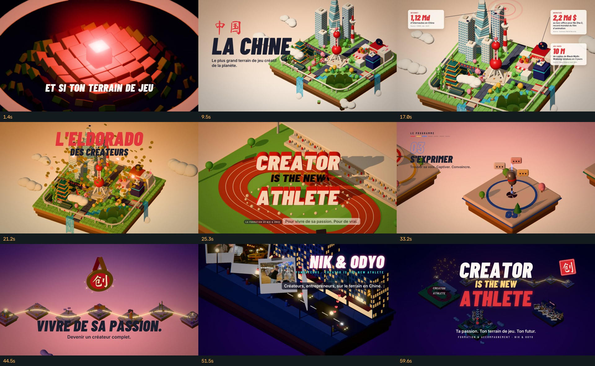

# Creator is the new athlete — pub 3D isométrique « La Chine, eldorado des créateurs »

Film de 62 s (1920×1080, 30 i/s) entièrement généré par code : modélisation 3D procédurale,
animation, caméra, typographie, post-production et bande-son. Pensé comme une pièce de portfolio
motion design. Il présente la formation **Creator is the new athlete** de **Nik & Odyo**.



## Le récit

| Temps | Séquence | Ce qui se passe | Son |
|---|---|---|---|
| 0–6 s | **L'étincelle** | Dans le noir, un cube rouge tombe. À l'impact, une onde de dalles dessine une île, puis la terre pousse dessous. « Et si ton terrain de jeu était à l'autre bout du monde ? » | chute, impact sub, glissando de guzheng |
| 6–12 s | **La Chine** | Le jour se lève et la ville se construit d'elle-même : tour à perles, gratte-ciel torsadé, pagode, maisons à cour, monts karstiques, rivière, cascades, train à grande vitesse, drones, studio de live | gong, le beat démarre |
| 12–20 s | **Les chiffres** | Cartes ancrées sur les bâtiments, compteurs animés, sources citées | tic des compteurs, carillons |
| 20–22 s | **L'eldorado** | Pluie de pièces d'or à l'heure dorée | pièces, nappe lumineuse |
| 22–28 s | **La marque** | Whip pan vers un stade. « Le talent ne suffit plus. » Puis CREATOR / IS THE NEW / ATHLETE s'écrase en 3D, le public saute | montée, roulement, triple impact, foule |
| 28–42 s | **Le programme** | 7 îles-stations, une mesure chacune : créer son projet, trouver son axe, s'exprimer, négocier, gérer son business, tenir dans le temps, s'entourer | un bruitage par module |
| 42–46 s | **Le créateur complet** | Le parcours s'illumine, médaille 创 : « Vivre de sa passion. » | accord, cloche |
| 46–56 s | **Nik & Odyo** | Rue chinoise de nuit, néons, taxi rouge et voiture jaune, les photos des fondateurs en polaroïds | groove de nuit, piano électrique, déclencheur photo |
| 56–62 s | **Final** | L'archipel de nuit, feux d'artifice, signature, sceau 创 | montée, feux d'artifice, accord final |

## Les chiffres et leurs sources

| Chiffre | Source |
|---|---|
| 1,12 milliard d'internautes en Chine | CNNIC, 57ᵉ rapport statistique (données déc. 2025) |
| 2,2 milliards $ au box-office pour *Ne Zha 2*, record mondial du film d'animation | Guinness World Records / Box Office Mojo |
| 10 millions de copies de *Black Myth: Wukong* en 3 jours | Game Science (annonce août 2024) |
| +185 % de chiffre d'affaires pour Pop Mart (Labubu) en 2025 | Pop Mart, résultats annuels 2025 |

## Fichiers

| Fichier | Contenu |
|---|---|
| `output/CITNA_pub_chine_1080p.mp4` | le film, H.264 + AAC |
| `output/soundtrack.wav` | la bande-son seule (48 kHz, 24 bits) |
| `output/storyboard.jpg` | planche des temps forts |

## Régénérer

```bash
cd pub-chine
npm install                         # three.js
pip install numpy scipy opencv-python-headless fonttools
python3 audio/soundtrack.py         # bande-son -> output/soundtrack.wav
node render.mjs still 9.5,24.5,48 --w 960 --h 540         # aperçus
node render.mjs frames --jobs 3 --out output/frames1080   # toutes les images
ffmpeg -framerate 30 -i output/frames1080/%05d.png -i output/soundtrack.wav \
  -c:v libx264 -preset slow -crf 18 -pix_fmt yuv420p -c:a aac -b:a 256k -shortest output/CITNA_pub_chine_1080p.mp4
```

Le rendu tourne dans Chromium sans écran (Playwright, WebGL logiciel).

- `timeline.json` : tous les temps forts, partagés par l'image et le son.
- `src/camera.js` : les mouvements de caméra.
- `src/shots/*.js` : une scène par acte.
- `src/shots/builders.js` : les modèles 3D.
- `audio/soundtrack.py` : la musique et les bruitages.
